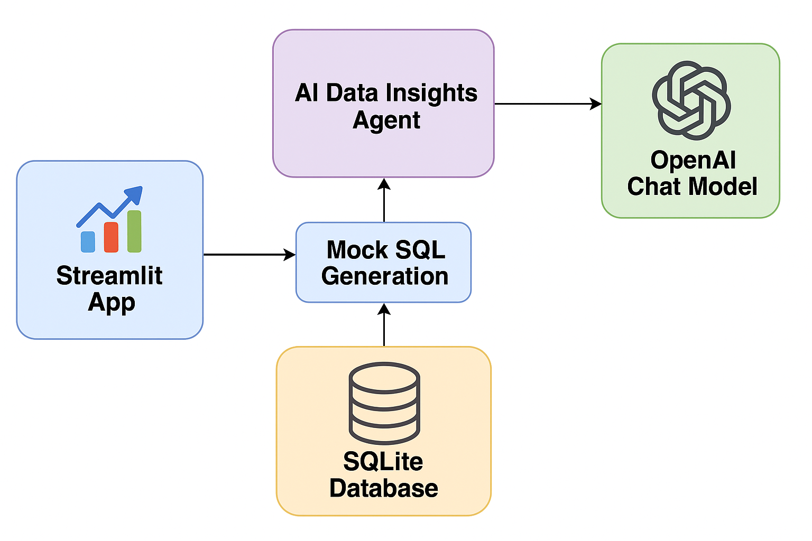

# 📊 AI Data Insights Agent  

**Developer:** Rohini Sondole  
**Type:** GenAI + SQL + Business Analytics  
**Environment:** Python 3.13 | Streamlit | LangChain | SQLite  

---

## 🧠 Overview  

The **AI Data Insights Agent** is a Streamlit-based web application that allows users to ask business questions in plain English and automatically receive:  
1️⃣ An interpreted **SQL query**  
2️⃣ A concise **natural-language summary**  
3️⃣ A **data visualization or table** of results  

This project merges **Natural Language Processing (NLP)**, **SQL generation**, and **data visualization** into a single interface — ideal for non-technical business users who need quick insights without writing SQL manually.  

---

## 🎯 Key Objectives  

✅ Translate natural-language questions into SQL queries  
✅ Execute queries safely on a structured database  
✅ Visualize outputs (bar / line charts) dynamically  
✅ Provide fallback operation if LLM API fails (mock mode)  
✅ Demonstrate GenAI integration with analytics stacks  

---

## 🧩 System Architecture  

| Layer | Modules | Description |
|:------|:---------|:------------|
| **Frontend** | `app/main.py` | Streamlit UI – handles input / output / visualization |
| **LLM Agent** | `app/agent.py` | Uses LangChain + OpenAI to generate SQL plans |
| **Database** | `app/db.py`, `data/retail.db` | SQLite database with sample retail data |
| **Utilities** | `app/utils.py` | Safety checks, dataframe conversion, plot helper |
| **Environment** | `.env` | Holds `OPENAI_API_KEY` and `DB_URL` |

📌 **Architecture Diagram:**  

📌 **Architecture Diagram:**

